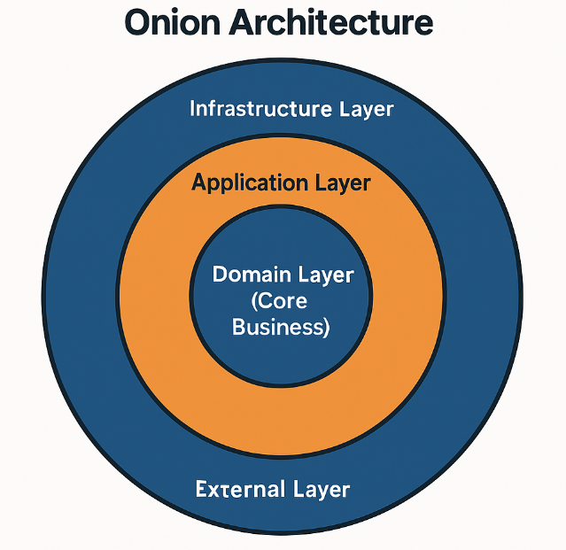

# Order Management Service (OMS)

**Order Management Service** is a highly reliable backend service for managing orders and payments, built on the principles of **Clean Architecture** and **Domain-Driven Design (DDD)**. The service guarantees idempotent operations, is ready for distributed microservice environments, and is designed for production use.

---

## Technology Stack

| Category               | Technologies           |
| ---------------------- | ---------------------- |
| **Language**           | Java 21                |
| **Framework**          | Spring Boot 3.x        |
| **Database Access**    | Spring Data JPA        |
| **Database**           | PostgreSQL             |
| **Build Tool**         | Gradle                 |
| **Containerization**   | Docker + Docker Compose|
| **Linters**            | Checkstyle, Spotbugs   |

---

## Architecture



The project is built according to the principles of:

- **Clean Architecture** — Clear separation of layers and independence of business logic from infrastructure.
- **Domain-Driven Design (DDD)** — Focus on domain models and business processes.
- **Hexagonal Architecture** — Ports and adapters to isolate the core.

### Project Structure

```
├── application/          # Application layer (use-cases)
│   ├── dtos/             # DTOs between layers
│   └── usecases/         # Use cases
├── domain/               # Domain core
│   ├── exceptions/       # Domain exceptions
│   ├── models/           # Business models
│   │   └── values/       # Value Objects
│   ├── repositories/     # Repository interfaces
│   └── services/         # Domain services
└── infrastructure/       # External world
    ├── controllers/      # REST API
    ├── dtos/             # DTOs for API
    │   ├── requests/
    │   └── responses/
    └── persistence/      # Database layer
        ├── entities/
        └── repositories/
```

---

## Domain Model: Entities and Value Objects

The domain layer is split into **entities** and **value objects**:

- **Entities** (`domain/models`)  
  Represent core business concepts with a stable identity, such as orders and payments.  
  Typical examples in this service:
    - `Order` – aggregate root that encapsulates the full lifecycle of an order: creation, status transitions, items and
      totals.
    - `Payment` – represents a payment attempt/transaction linked to an order, including its current status and audit
      data.
    - Supporting entities (e.g. `OrderItem`) – describe parts of an aggregate but still carry their own business rules.

- **Value Objects** (`domain/models/values`)  
  Immutable objects that describe *attributes* of the domain with built-in validation and invariants.  
  Typical examples:
    - `Money` – amount and currency with safe arithmetic and comparison rules.
    - `OrderId`, `PaymentId` – strongly-typed identifiers instead of raw primitives.
    - Other small concepts like statuses, email addresses or customer references.

---

## Configuration

**Spring Profiles** are used for different environments:

| Configuration File     | Purpose |
|------------------------|---------|
| `application.yml`      | General configuration |
| `application-dev.yml`  | Development settings |
| `application-prod.yml` | Production settings |
